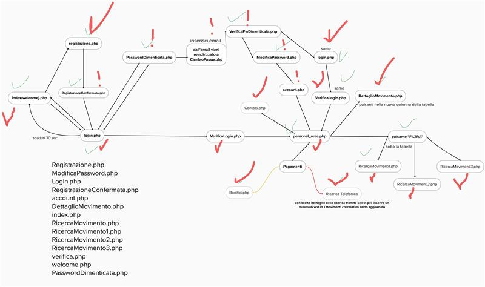

# Website structure

Here is the main structure of the website:

<figure><figcaption></figcaption></figure>

The main peculiarities of it are:

* Safe login with username and password
* MFA with email
* bank transactions
* simulation of telephone credit top-up
* Transaction visualization: Interactive storyboard, export to CSV.
* fillable form for customer support
* ui dashboard for recent transactions
